## はじめに  
### モチベーション  
RStudioとGitHubを紐づけて楽をしようと思ったら予想外に手間取りました。自分が困ったところは他の人も困っているかもしれないですし，自分用の覚書としてネットの海に放流することにしました。**楽をするための苦労は厭わない**，をモットーにやっていきます。  
できるだけGUIを使った操作だけで完結するようにしましたが，一部でコマンドラインの操作が入ります。なぜかというと，自分がやったときにコマンドラインの操作が必要になったからです。でもほんの一部ですし，たぶん大丈夫。


### 前提  
  - RStudio，R，Gitインストール済み  
  - GitHubのアカウント取得済み  
  - GitHubのパブリックリポジトリを使用します（プライベートリポジトリでは未検証）  
**ぼくはこれで出来ました**ってだけなので，他のもっと早くて楽な良い方法があるかもしれません。  

### 環境  
- 使ったOS  
    - macOS Sierra (10.12.6)   
    - そろそろOSアップグレードしないといけないけど，勇気が出ない  
- RStudio & R  
    - RSstusio (Version 1.1.442)  
    - R (Version 3.4.4)  
    - こっちもそろそろアップデートしないといけないけど，パッケージ関係で時間が溶けそうなので中々動けない  

### 免責事項  
- 筆者はただRやPCが好きな非プログラマです。
- この記事は，後述の参考サイトを元に作りました。
- あくまで自分用の覚書を垂れ流しているものです。

## 本編  

### GitHub側でやること  
以下のURLから新しくリポジトリを作ります。  

https://github.com/new  

リポジトリの名前は，あとでRStudioで作るプロジェクトと同じ名前が良いそうです。必要ならDescriptionのところにリポジトリの説明を書きます。

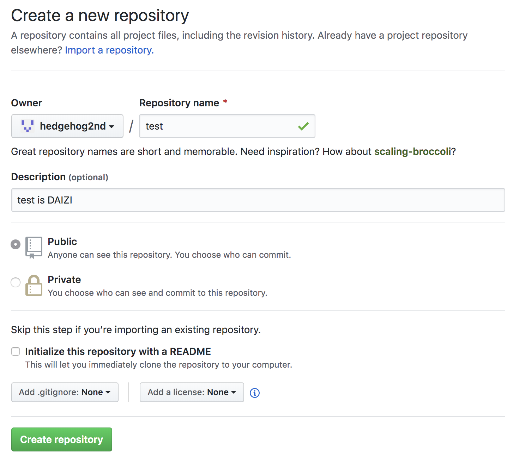
RStudioで作ったファイルをGitHubにあげていくので，
ページの下のほうにあるAdd ".gitignore:"や"Add a license:"，
"Initialize this repository with a README"は**何も触らずに**`Create repository`をクリック。  

すると，いろいろなコマンドのようなものが並んだページに飛びます。**ここで`git@`からはじまるリポジトリURLをコピー**して，適当なテキストエディタにでも貼り付けておきます。あとから使います。

### RStudio側でやること
RSstudioとGitHubを設定していきます。  

RStudioでSSHを発行します。
メニューバーの`Tools`から`Global Options...`を選択。下のような画面が出るので，`Git/SVN`を選択して，`Create RSA Key...`ボタンをクリック。発行されたSSHは同じ画面の`View public key`で表示できますので，`command + c`でコピーします。

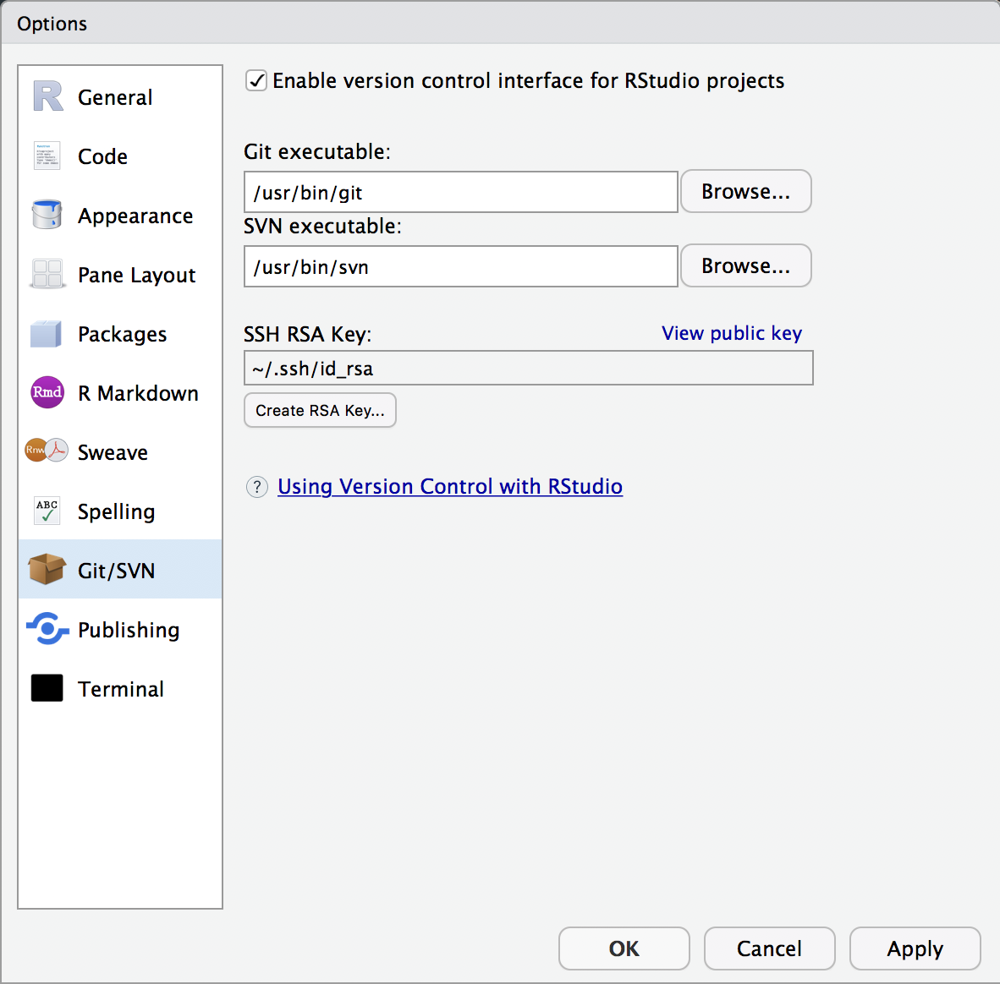

一旦，GitHubに戻って`Setting->SSH and GPG keys`と辿っていって，`New SSH key`をクリック。Keyのところに，さっきコピーしたSSH keyを貼り付けます。Titleは（今回は）適当で問題ありません。複数のSSH keyを使い分ける必要がある方は，なんのkeyなのか分かる名前を付けたほうが良いです。
`Add SSH key`ボタンをクリックすれば，登録完了です。このSSH keyの発行から登録までの作業は，1回やればOKだそうです。レポジトリを新しく作っても，SSH keyを新しく発行する必要はありません。ただしGitHubアカウントを新規作成した場合は，新たにSSH keyを登録しないといけないようです。

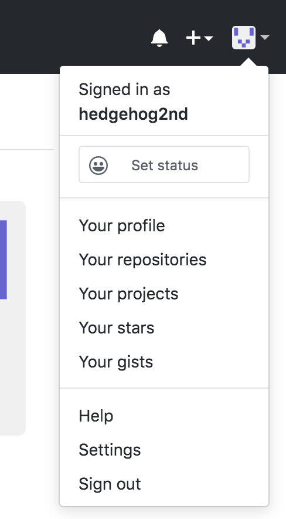  
  

RStudioに戻り，新しくプロジェクト作ります。  
メニューバーの`File`から`New Project...`を選ぶと，以下の画面が出ますので，New Directoryを選択します。  

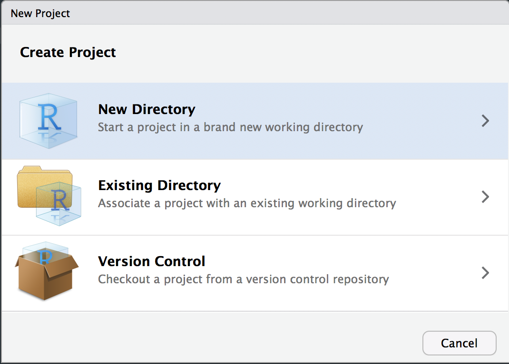

すると，どんなプロジェクトを作ろうとしてるのか聞いてきますので，New Projectをクリック。  

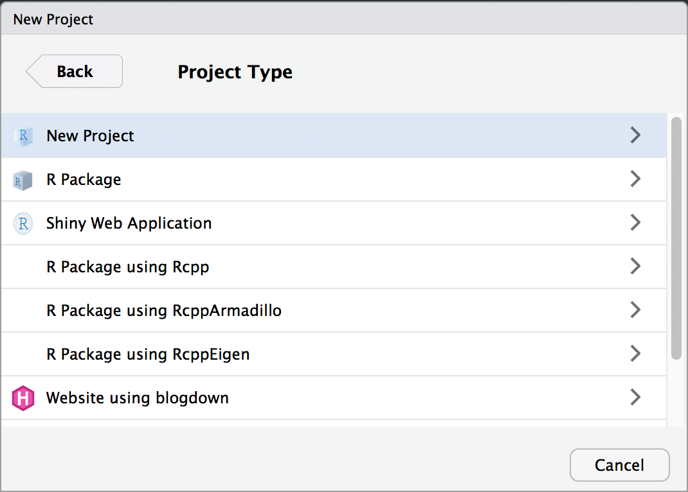

以下のような画面が出るので，適当な場所を指定し，GitHubで作ったリポジトリと同じ名前をつけます。ここで，`Creare a git repository`のところにチェックが入っていることを確認。私は下の方にある`Open in new session`のボックスもチェックして，新しくセッションを作ってます。  
右下にある`Creare Project`ボタンを押せば，git付きのプロジェクトが作られます。
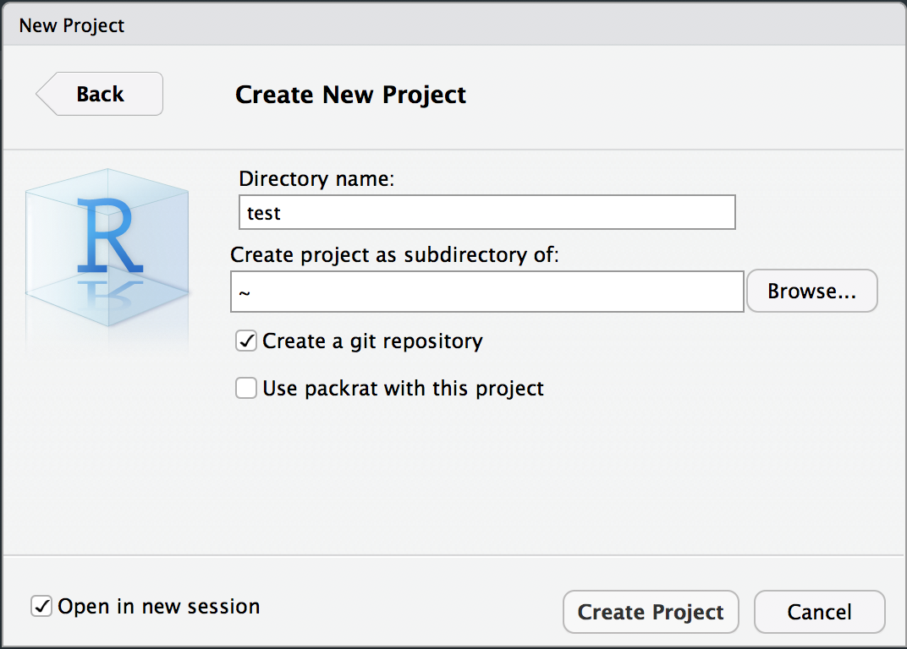

一応，ちゃんと作成されたか確認してみましょう。  
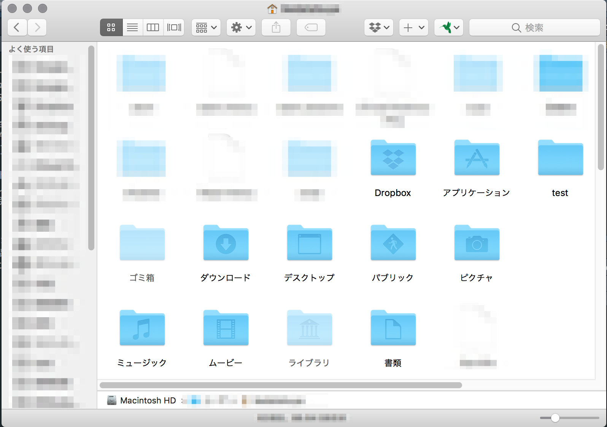

生成されたばかりのプロジェクトの中身は，こんな感じです。  
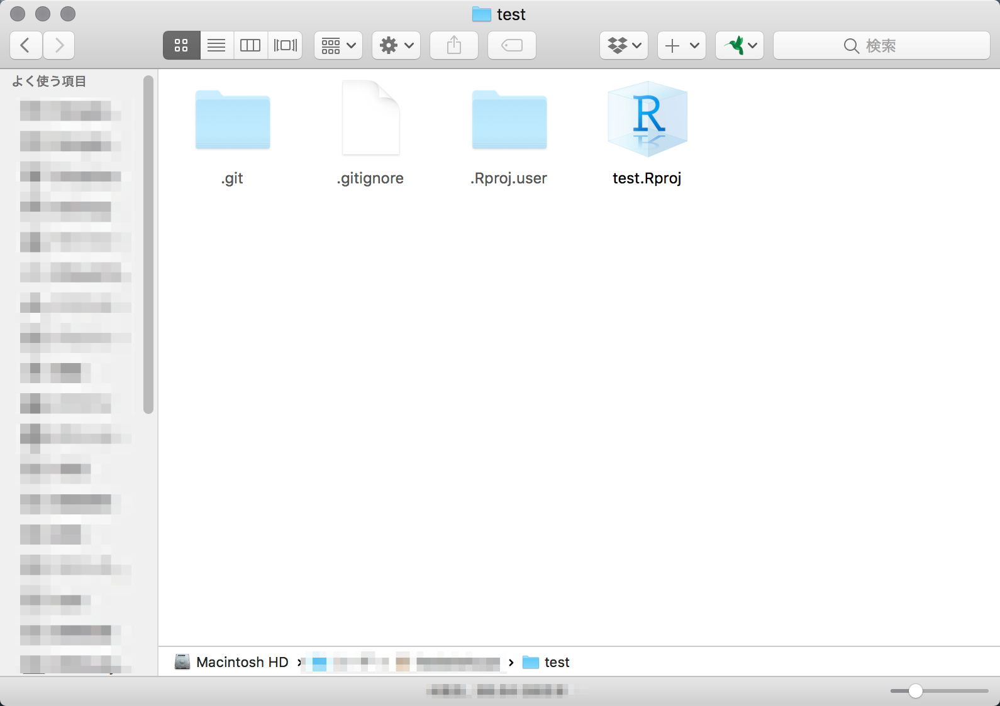

RStudioのペインにも`Git`タブが出来ているはずです。  
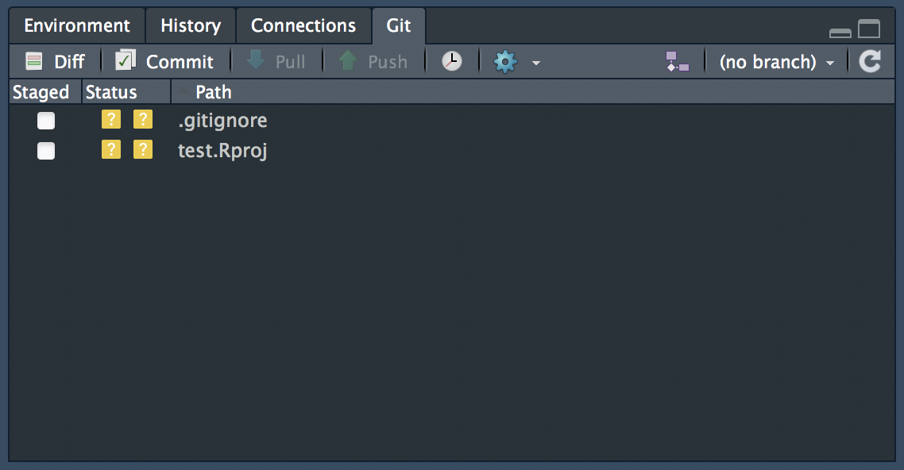  

gitタブの歯車のアイコンをクリックし，`Shell...`を選択。ターミナルを立ち上げます。
そこに以下の内容を入力します。一行目の`git remote add origin`のあとは，さっきメモしておいたリポジトリのURLを入力します。  
```
git remote add origin git@github.com:hogehoge/fooo.git(さっきメモしたリポジトリURL)
git add .
git commit -m "initial"
git push origin master
```

これでPC側（ローカルリポジトリ）のファイルやら何やらが，GitHub側（リモートリポジトリ）へpushされました。同時に，いままで`(no branch)`と表示されていたところが，`master`になっているのが分かります。きちんとLocalとRemoteも作成されてます。

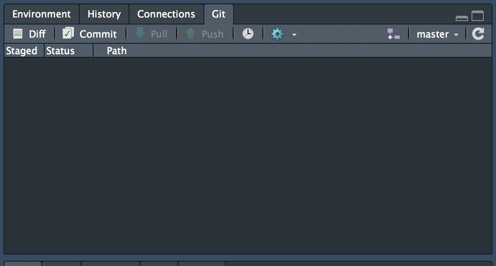

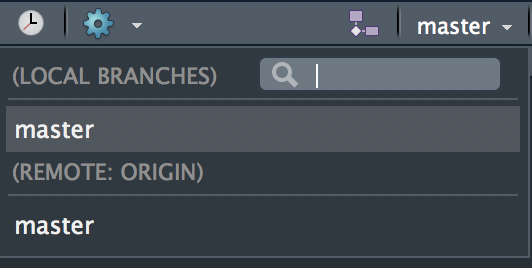

GitHub側に反映されているのを確認します。

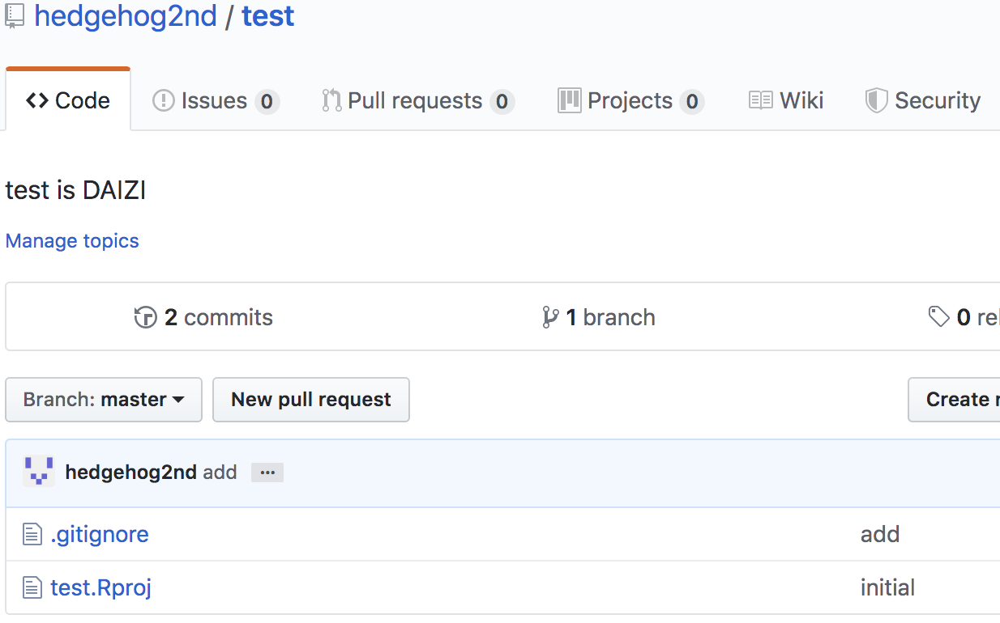

はい，OKですね。`.gitignore`を編集してpushしたあとの画像ですが，PCからGitHubへファイルを渡せているのが確認できますね。


### Gitの設定
これは必要なのかどうか分からなかったのですが，自分はやったので書いておきます。  
ここではターミナルを使ってgitのユーザー名とアドレスをPCに登録します。ここで登録されたユーザー名をメールアドレスが，GitHubの履歴に残ります。  
なお，ユーザー名は" "(ダブルクオーテーション)で囲まないといけませんが，メールアドレスは" "が不要です。
```
git config --global user.name "ユーザー名"
git config --global user.email sample@email.com
```

### PullとPushアイコンがグレーなんですけど  
さっきのGitタブ，よく見るとPullとPushがグレーになってて，押しても反応しません。masterと表示されてるので，間違いなくGitHub側(リモートリポジトリ)に接続できてるはずなのに。
  
ターミナルなりShellなりでpushすればいいのかもしれませんが，できるだけRStudioと共に生きたいので，このままでは困ります。これについては[盆栽日記さん](https://dichika.hateblo.jp/entry/20180102/p1)に解決法が載っていて，pushするときに`Gitタブ>歯車>shell...`で，以下のようにすれば良いようです。

```
git push -u origin master
```

`-u`をつけてpushすることで，デフォルトでpushするブランチを設定できるんだそうです。


## おわりに  
RStudioとGitHubの連携，また詰まる日が来そうなのでまとめてみました。正直，もっとスマートなやり方がある気がして仕方ないのですが，まだ最適解は見つけてません。新しく良い方法があったら追記していきます。

## 感謝してもしきれない参考サイト
[DISTRICT 37 - RstudioからGithubを使う](http://dragstar.hatenablog.com/entry/2016/04/26/185546)  
[盆栽日記 - githubとRStudioを使って最速でパッケージを全世界に大公開](https://dichika.hateblo.jp/entry/20140311/p1)  
[盆栽日記 - RStudioでPull/Pushボタンがグレーアウトしている時の対処](https://dichika.hateblo.jp/entry/20180102/p1)  
[Qitta - 【Git】リモートにブランチを push してそのままトラックする](https://qiita.com/sunstripe2011/items/a39f4bb835e1f08760e7)  
[ラボラジアン - Git でユーザー名とメールアドレスを設定する方法（全体用とプロジェクト用）](https://laboradian.com/set-git-user-and-email/)  
